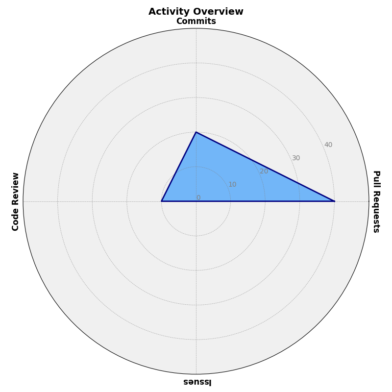

  
  

<h3 align="center">A passionate DevOps enthusiast and Python developer from India</h3>

  

  

## About Me

I have been working as an Aspiring DevOps Engineer, specializing in Python and related technologies. My expertise lies in developing robust and scalable applications, integrating various tools, and ensuring the best system performance. I am always keen to learn new technologies and stay updated with the latest industry trends.

- 🌍 **Location**: India
- 💼 **Role**: Aspiring DevOps Engineer
- 📧 **Email**: [amitkaushik337@gmail.com](mailto:amitkaushik337@gmail.com)

- 🔭 I’m currently working on [NTP Server Monitoring](https://github.com/amitkcodes/NTP_Server_Monitoring_Grafana-WAN-)
  
- 🔭 Check my portfolio on [Portfolio](https://amitkcodes.github.io)

- 🌱 I’m currently learning **Kubernetes, AWS, Prometheus, Grafana, Terraform**

- 👯 I’m looking to collaborate on **DevOps, automation, open-source projects**

- 🤝 I’m looking for help with **Advanced CI/CD, cloud orchestration**

- 📝 I regularly write articles on [DevOps blog](https://yourblog.com)

- 💬 Ask me about **Python, Docker, Git, NTP, Flask API, monitoring**

- 📫 How to reach me **amitkaushik337@gmail.com**

- ⚡ **Fun Fact**: I geek out on perfecting system synchronization!

<!-- ## Pinned Projects 📌
- [amitkcodes.github.io](https://amitkcodes.github.io)  
  _A personal portfolio showcasing my work._
- [NTP_Server_Monitoring_Grafana-WAN-](https://github.com/amitkcodes/NTP_Server_Monitoring_Grafana-WAN-)  
  _A Python-based NTP server monitoring system with Grafana integration._
- [Network_Time_Display_Synchronization-Alert-System](https://github.com/amitkcodes/Network_Time_Display_Synchronization-Alert-System)  
  _A Flask-based alert system for time synchronization._
- [Certification_Completion](https://github.com/amitkcodes/Certification_Completion)  
  _Repository tracking my certification progress._
- [Firewall_Logs_data_filter-Visualization](https://github.com/amitkcodes/Firewall_Logs_data_filter-Visualization)  
  _Python script for filtering and visualizing firewall logs._
- [Global_server_monitoring_Status](https://github.com/amitkcodes/Global_server_monitoring_Status)  
  _Monitoring tool for global server status._ -->

## Goals 🎯
- Become a Certified Kubernetes Administrator by 2026  
  _Progress: _
  - 📅 Started: September 2025
  - 📚 Learning Resources: [Kubernetes.io](https://kubernetes.io/)

### 📫 **How to reach me**
 - 🌐 LinkedIn: [AMIT KAUSHIK](https://www.linkedin.com/in/amit-kaushik-507831150/)

 - 📧 Email: [amitkaushik337@gmail.com](mailto:amitkaushik337@gmail.com)

<h3 align="left">Languages and Tools🛠️:</h3>

 
  <!-- DevOps and Scripting -->
     
     
     
     
     
     
     
     
     
     
     
       
     
      
     
     
     
     
   <!-- Cybersecurity Skills --> 
    
    
    
 

## GitHub Stats 🌟🌟🌟

  
  
  

## Activity Overview 📊

  

<!-- ## More About Me 🌟
- Hobbies: Exploring open-source DevOps tools, reading cloud architecture blogs -->
