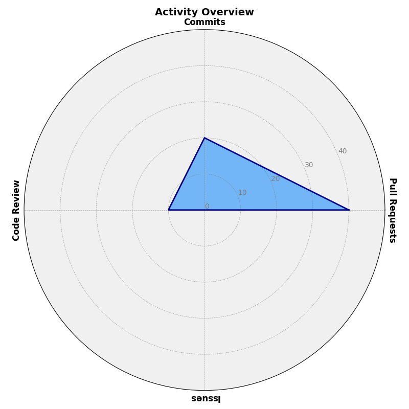

  
  

<h3 align="center">Empowering Tomorrow with Professional DevOps and Python Solutions</h3>

<!--
  

  
-->

## About Me

I have been working as an Aspiring DevOps Engineer, specializing in Python and related technologies. My expertise lies in developing robust and scalable applications, integrating various tools, and ensuring the best system performance. I am always keen to learn new technologies and stay updated with the latest industry trends.

- 🌍 **Location**:Delhi,India

- 💼 **Role**: Aspiring DevOps Engineer
  
- 📧 **Email**: [amitkaushik337@gmail.com](mailto:amitkaushik337@gmail.com)

- 🔭 I’m currently working on [NTP Server Monitoring](https://github.com/amitkcodes/NTP_Server_Monitoring_Grafana-WAN-)
  
- 🔭 Check my portfolio on [Portfolio](https://amitkcodes.github.io)

- 🌱 I’m currently learning **Kubernetes, AWS, Prometheus, Grafana, Terraform**

- 👯 I’m looking to collaborate on **DevOps, automation, open-source projects**

- 🤝 I’m looking for help with **Advanced CI/CD, cloud orchestration**

- 💬 Ask me about **Python, Docker, Git, NTP, Flask API, monitoring**

## Goals 🎯
- Become a Certified Kubernetes Administrator by 2026  
  _Progress: _
  - 📅 Started: September 2025
  - 📚 Learning Resources: [Kubernetes.io](https://kubernetes.io/)

## How to reach me 📫
 - 🌐 LinkedIn: [AMIT KAUSHIK](https://www.linkedin.com/in/amit-kaushik-507831150/)

 - 📧 Email: [amitkaushik337@gmail.com](mailto:amitkaushik337@gmail.com)

## Languages and Tools🛠️

 
  <!-- DevOps and Scripting -->
     
     
     
     
     
     
     
     
     
     
     
       
     
      
     
     
     
     
   <!-- Cybersecurity Skills --> 
    
    
    

## GitHub Stats 🌟

  <table>
    <tr >
      <!--Top Language -->
      <td align="center">
        
      </td>
      <!-- GitHub Stats -->
      <td>
        
         
          
      <!-- LeetCode Streak -->
      </td>
    </tr>
  </table>

## Activity Overview 📊

  

## More About Me 🌟
- Hobbies: Exploring open-source DevOps tools, delving into AI tools and open-source resources to enhance automation skills, reading cloud architecture blogs, experimenting with new programming languages, contributing to community projects, and playing strategy games.
